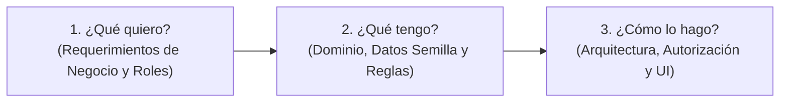
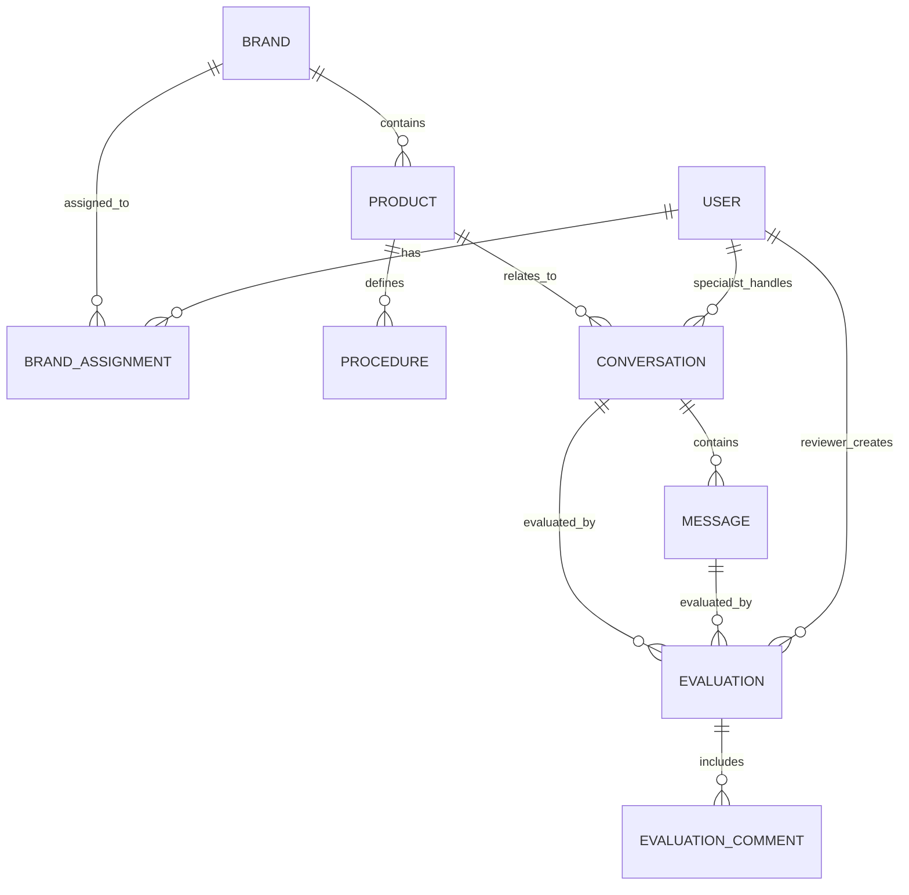

# Conceptos Base del Proyecto Sellervate QA

Este documento establece los fundamentos conceptuales, el modelo de dominio y la metodología operativa del sistema de revisión y aseguramiento de calidad (QA) para la atención al cliente multimarca de Sellervate.

---

## 1. Metodología de Implementación

Para garantizar una solución compacta, defendible y enfocada en el valor de negocio, el diseño y desarrollo se estructura en torno a tres interrogantes fundamentales:

---

### 1.1 ¿Qué quiero?

#### Perspectiva del Administrador / Supervisor (Team Lead)
- **Plataforma Práctica de Auditoría Post-hoc**: Visualizar, analizar y ponderar las conversaciones y respuestas emitidas por los especialistas de atención al cliente sobre diferentes marcas y productos.
- **Intercambio de Feedback Cualitativo y Cuantitativo**: Calificar mensajes/conversaciones con una escala estandarizada y adjuntar observaciones constructivas que permitan el entrenamiento continuo del especialista.
- **Base de Conocimiento y Procedimientos por Marca**: Disponer de la documentación procedimental y de preguntas frecuentes asociadas a cada producto/marca para auditar si la respuesta cumplió con el tono, precisión técnica y política de la marca (ej. diagnóstico previo en productos técnicos vs. brevedad y rapidez en insumos genéricos).
- **Métricas e Indicadores de Rendimiento (KPIs)**:
  - Evolución temporal de la calidad de respuestas por especialista y por marca.
  - Porcentaje de respuestas/conversaciones distribuidas por nivel de ponderación.
  - Tiempos promedio de respuesta por especialista.
  - Datos concretos para demostrar a las marcas cliente la mejora del servicio trimestre a trimestre.

#### Perspectiva del Especialista
- **Panel de Autoconsulta y Coaching**: Espacio individualizado para revisar sus propias conversaciones, las ponderaciones recibidas y las observaciones detalladas del supervisor.
- **Estadísticas Personales de Desempeño**:
  - Distribución porcentual de ponderaciones obtenidas.
  - Tendencia de calidad a lo largo del tiempo (por semana/mes).
  - Detección de oportunidades de mejora basadas en el feedback recibido.
- **Privacidad y Aislamiento**: Ver únicamente su propia información sin acceso a las revisiones ni métricas de otros especialistas.

---

### 1.2 ¿Qué tengo?

- **Estructura Multimarca Jerárquica**:
  - `Marca (Brand)` $\rightarrow$ `Categoría` $\rightarrow$ `Producto`.
  - Procedimientos de atención, guías de tono y preguntas frecuentes (FAQs) asociadas a cada producto/marca.
- **Datos Semilla (Seed Data) con Intención**:
  - Conversaciones e intercambios reales entre clientes y especialistas.
  - Variedad deliberada: respuestas excelentes, respuestas conformes y respuestas intencionalmente deficientes (ej. omisión de historial, tono incorrecto o diagnósticos erróneos).
  - Al menos 2 marcas distintas, 3 especialistas y 2 supervisores.
- **Modelo de Ponderación y Observaciones**:
  - Estados y escalas de calificación aplicables tanto a nivel de conversación general como a nivel de mensaje individual.
  - Hilo de observaciones/feedback vinculado a cada evaluación.

---

### 1.3 ¿Cómo lo hago?

- **Pila Tecnológica**:
  - **Framework**: Next.js 16 (App Router) con TypeScript.
  - **Base de Datos**: PostgreSQL vía Supabase.
  - **Estilos e Interfaz**: Tailwind CSS con daisyUI y Lucide Icons.
  - **Visualización de Datos**: Recharts para gráficos de tendencias y distribuciones.
- **Aislamiento y Autorización en Servidor**:
  - Implementación de un selector de usuarios (*User Switcher*) para simular sesiones en entorno local de evaluación.
  - **Autorización estricta forzada en el servidor** (Server Components, Server Actions y consultas parametrizadas con RLS) para impedir fugas de datos entre especialistas o acceso a marcas no asignadas.
- **Cálculo Eficiente de Métricas**:
  - Consultas agregadas y funciones en servidor para procesar KPIs de calidad y tiempos de respuesta directamente en la capa de datos.

---

## 2. Límites y Claridad del Alcance (Qué ES y qué NO ES)

| Aspecto | Qué ES el Sistema | Qué NO ES el Sistema |
| :--- | :--- | :--- |
| **Naturaleza del Producto** | Herramienta interna de QA, evaluación y coaching post-hoc. | Helpdesk en vivo, bandeja de entrada para responder a clientes o sistema de tickets. |
| **Origen de Mensajes** | Conversaciones y respuestas que ya sucedieron e ingresaron al sistema. | Interfaz de mensajería o chat directo con clientes finales. |
| **Rol de la IA** | Estrategia de triaje asíncrono documentada para V2; asistencia en desarrollo y generación de datos semilla. | Modelo de scoring automatizado en tiempo de ejecución en V1 (evitando wrappers innecesarios). |
| **Seguridad / Auth** | Selector de usuario simulado en cliente con **autorización estricta forzada en servidor**. | Sistema pesado de autenticación OAuth/SAML que consuma tiempo del core de producto. |

---

## 3. Modelo de Entidades del Dominio

1. **User**: Supervisores (Team Leads) y Especialistas.
2. **Brand**: Marcas representadas con su configuración de tono y SLA.
3. **BrandAssignment**: Asignación de supervisores y especialistas a marcas específicas.
4. **Product**: Catálogo de productos por marca y categoría.
5. **Procedure / FAQ**: Base de conocimientos y pautas de resolución por producto.
6. **Conversation**: Hilo de interacción histórica asociada a un cliente, especialista y producto.
7. **Message**: Cada mensaje individual del cliente o respuesta del especialista.
8. **Evaluation**: Calificación cuantitativa asignada a una conversación o respuesta.
9. **EvaluationComment**: Retroalimentación y observaciones cualitativas del supervisor.

